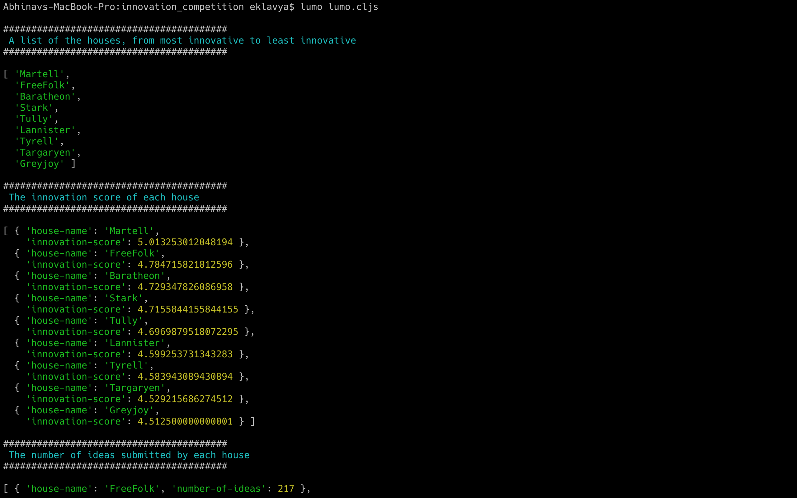
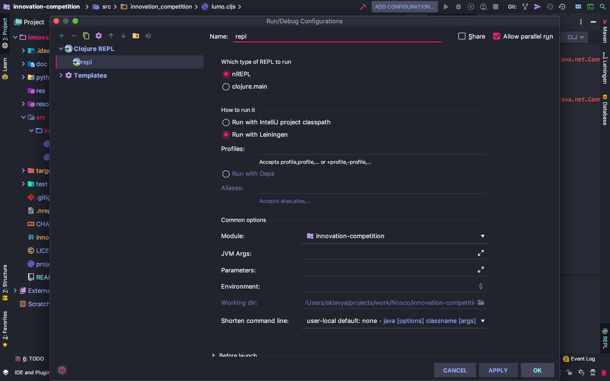
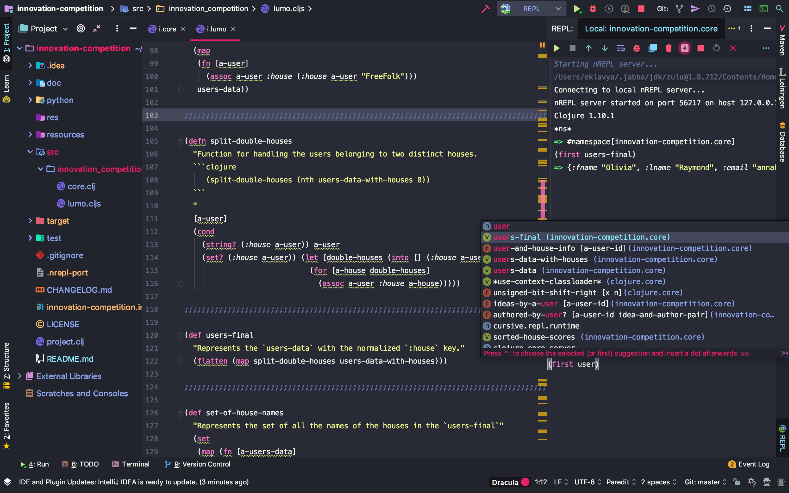
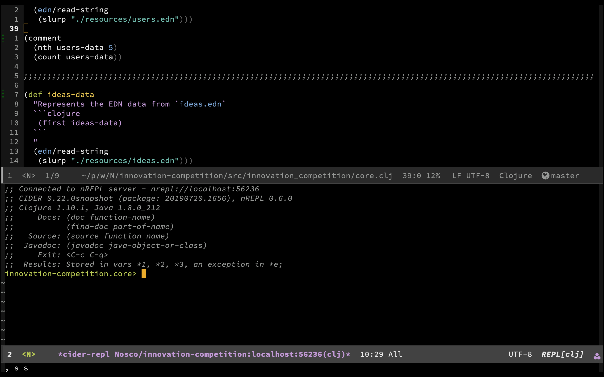
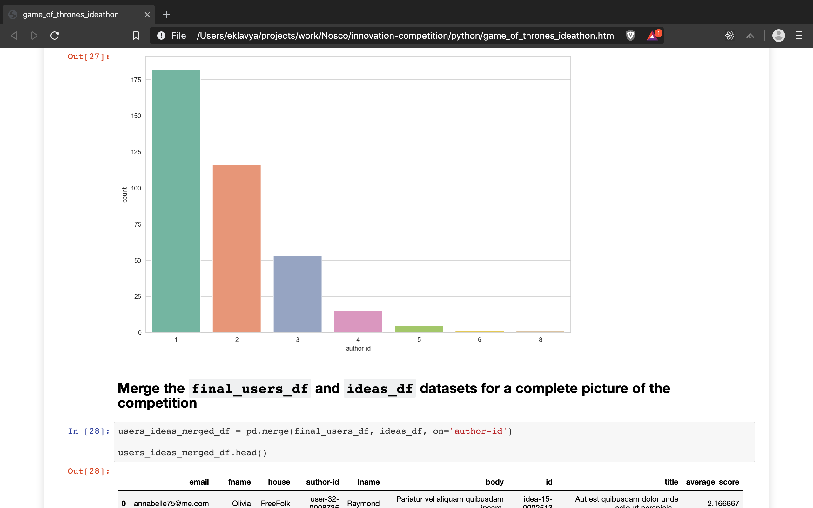

# Problem Statement: Nosco Hiring Challenge

There is an *innovation competition* across the land, and the various
houses compete. All the ideas have been collected and scored, and now is the time
to calculate the results to find out the most innovative houses.

- The `innovation score` of a house is simply the `average scores` of all the ideas
submitted by people affiliated with this house. 

- Higher is better. 

- Ideas with no scores are excluded from consideration.

- Some people are affiliated with no house, in which case they should be counted as if in the house 'Free folk'.

- Some people are affiliated with more than one house, in which case the idea is credited to each and every one of the affiliated houses. For example, if user A is affiliated with houses X and Y, and they have submitted an idea that has a score of 5.7, both house X and Y will add a score of 5.7 in their tally.

## Input Data

The input data is two JSON files, and their EDN counterparts (containing the same data).

- `users.json` contains various users, each having an id first name, last name, email, and potentially a list of their house affiliation(s).

- `ideas.json` contains various ideas, each one having an id, a title, a body, an author-id (pointing to one entry in the `users.json` file) and an array of numeric scores. Unfortunately some scores were lost and were replaced by nulls. These scores should be ignored entirely.

## Expected output

The results should include:

[x] an list of the houses, from most innovative to least innovative

[x] the innovation score of each house

[x] the number of ideas submitted by each house

## Other considerations

[x] Reasonable performance is expected, but readability of the code is more
important. Use descriptive names and add docstrings and comments as needed.

[x] You're free to use any 3rd-party library that seems suitable for the
task, keeping in mind how it might affecte the readability of the code for someone
who isn't familiar with it.

[x] The code should include instructions on how to run it and get the results.

[x] Any reasonably popular build tool is fine, or a single file with
side-effectful statements will also do. Use the tool that will allow
you to move to actually solving the problem.

[x] There's no need to write a test suite for this exercise.

--------

# Solution by Abhinav Sharma (abhi18av@outlook.com)

## Design Considerations

- Could have used `:^private` or `defn-` if this was a library oriented solution. However, as mentioned in the challenge description I've optimized for readibility rather than less number variables or more `let` bindings along with other deep clojure constructs. This would be caliberated as per the team standard.

- Opted to deliver the base solution in the a single `lumo.cljs` file so as to avoid the hassle of setting up a build configs and slow startups.

- I have only used the `clojure standard library` since, it's already there and I wanted the code to be usable by vanilla installation of `lumo`. 

- Didn't use `spec` at all.

- Depending on the team's comfort level, standard and design choices, I might have opted for [specter](https://github.com/nathanmarz/specter) or [medley](https://github.com/weavejester/medley) to simplify things

## Thoughts

- A shared resource pool would be really helpful like [Clojure - The Essential Reference](https://www.manning.com/books/clojure-the-essential-reference) or [PurelyFunctional](https://purelyfunctional.tv/) courses. This way, as a team we could be sure of each other's miminal knowledge base.

- In production for nested queries, I think it might be worth trying out pathom [pathom](https://github.com/wilkerlucio/pathom) for traversing nested queries.  

## Solution-1: ClojureScript (via Lumo on Terminal)

#### Instructions to download and setup lumo
Lumo bundles `ClojureScript` and `NodeJS` together as a single binary. More info can be found at https://github.com/anmonteiro/lumo. 

I've used it in the past to create the classic snake game using the browser's `canvas` API - [luminus-snake](https://github.com/abhi18av/luminus-snake/tree/master/v1.0)

The core solution is based around a single file `./src/innovation_competition/lumo.cljs` which is intended to be used as follows

```
> cd ./src/innovation_competition/
> lumo lumo.cljs
```
The solution would be printed out as like so



You could also just compile the `lumo.cljs` solution to `NodeJS` ready solution by using the bundled clojurescript compiler like done here [luminus-snake/build_snake.cljs](https://github.com/abhi18av/luminus-snake/blob/master/v1.0/build_snake.cljs)

## Solution-2: Clojure (via REPLs)

The `./src/innovation_competition/core.clj` file is the file which is meant to be used with a `REPL` as it contains commented code-snippets which could be used to explore the state of variables and the functionality of functions.

- Terminal REPL
The simplest way to start a repl would be to do `lein repl` and it'll land you in the `innovation_competition.core` namespace. Feel free to play around :) 

- Cursive via IntelliJ

You'll need  to open the project in the `IntelliJ` iwth `Curisive` plugin installed and the config the **local** nrepl like so




Once the `REPL` fires up, you can confirm the namespace you can use `*ns*`



- Spacemacs 
$$ Just open the `core.clj` and press `,'` and you'd `jack in` right into the `innovation_competition.core` namespace



## Solution-3: Python (via Jupyter)

This was a really fun problem to work with and I explored the solution using another tool I have, which is `Python` and so you can find the `HTML` or the `Jupyter Notebook` in the `./python` directory.



## Feedback

- It was a wonderfully refreshing test and this ability of clojurians to try new things is the reason why I am so fond of clojure and it's community. 

- To avoid the multiple build tools you might need to install to evaluate various other submissions, you could ask people to use [nextjournal](https://nextjournal.com/nextjournal/clojure-environment) as it comes with an in-built `clojure` and `clojurescript` repl. Think of it as a much better version of `jupyter notebooks`.

## Things I tried
- Adding [rebel-readline](https://github.com/bhauman/rebel-readline) library to the project to make the `lein repl` colorful but decided against adding another dependency.
- Exploring the data via [cognitect's REBL](https://github.com/cognitect-labs/REBL-distro), couldn't make it work :( 

